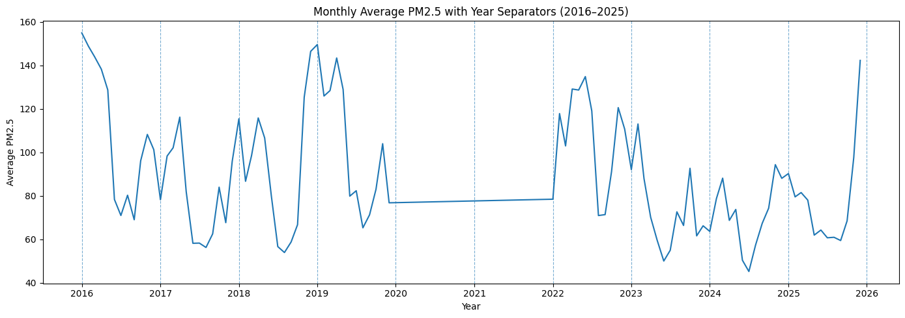
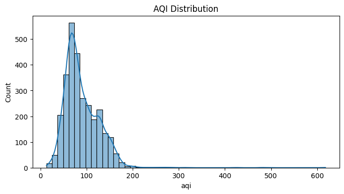
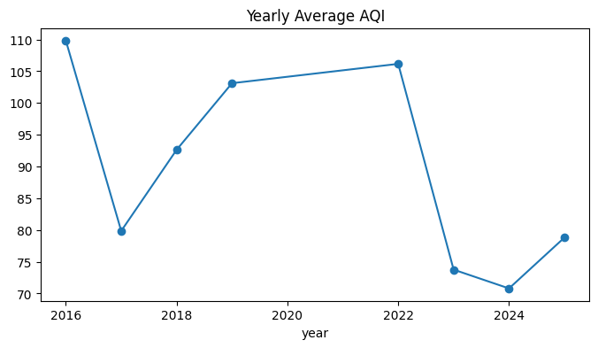

# 📈 Next-Day PM2.5 AQI Prediction  
**BTM Layout Station, Bengaluru (US EPA Standard)**

🔗 **Live Application**  
👉 https://vins-tech-aqi-prediction-model.streamlit.app/

🔗 **Deployment Repository**  
👉 https://github.com/Vins-Tech/app_aqi_prediction_deploy

---

## 🧠 Project Overview

This project focuses on **next-day PM2.5 AQI prediction** for a **single monitoring station — BTM Layout, Bengaluru**.  
The goal is to build a **time-aware, leakage-free machine learning system** that predicts the **next day AQI** using historical AQI patterns and meteorological data.

📌 **Data Curation Note**  
AQI data from **2020 and 2021 (COVID-19 period)** was **intentionally excluded** from model training due to abnormal emission patterns caused by lockdowns, which could bias long-term trend learning.

⚠️ **Scope**  
This model is **station-specific** and is **not intended for city-wide AQI prediction**.

---

## 🏆 Final Model

- **Algorithm:** Gradient Boosting Regressor  
- **Final R² Score:** **0.89**  
- **Training:** Selected features only  
- **Inference:** Uses the same feature pipeline as training

---

## 📊 Exploratory Data Analysis (EDA)

All EDA plots are available in the `eda_plots/` folder. Key insights include seasonality, long-term trends, and temporal dependencies.

### Monthly AQI Trend (2016–2025)

### AQI Distribution

### Average Monthly AQI

### Yearly Average AQI

---

## 🧪 Feature Engineering

The model relies on engineered features generated strictly from **past data only**, ensuring time-series correctness.

**Feature Categories:**
- Lagged AQI values
- Lagged weather variables
- Temporal features (day of year, month)
- Interaction features (e.g., temperature × humidity, wind dispersion metrics)

---

## 🔗 Data Sources (Free APIs)

- 🌦️ **Weather Data:**  
  https://www.visualcrossing.com/

- 🌫️ **AQI Data (BTM Layout):**  
  https://aqicn.org/historical/#!city:india/bangalore/btm

---

## 🚀 Deployment Architecture

- **This Repository:** Data processing, EDA, feature engineering, model training
- **Deployment Repository:** Streamlit app, inference pipeline
- **Frontend:** Streamlit
- **Model Loading:** Joblib
- **Usage Control:** Shared daily prediction limit

🔗 Deployment code: https://github.com/Vins-Tech/app_aqi_prediction_deploy

---

## 📌 Application Workflow

1. User selects **target date (tomorrow)**
2. User enters **today’s PM2.5 AQI**
3. System generates all required features internally
4. Model predicts next-day AQI
5. Features used are displayed for transparency
6. AQI reference chart is shown (WAQI standard)

---

## ⚠️ Limitations

- Model is valid **only for BTM Layout station**
- Performance depends on stability of AQI and weather patterns
- Not intended for medical, legal, or regulatory use

---

## 👨‍💻 Author

**Vinay S**  
📧 **Email:** vins.techn@gmail.com

